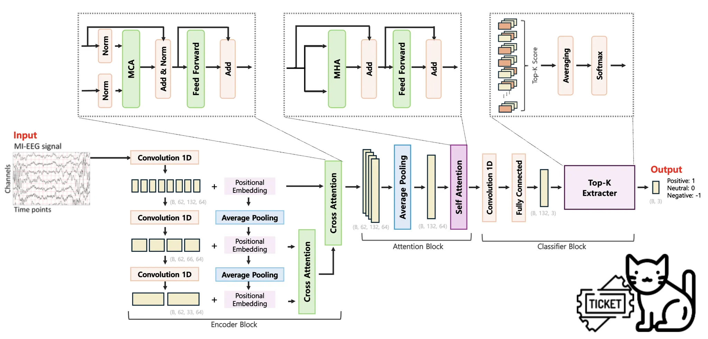

# Attention 기반의 장단기적 시간 정보를 활용한 EEG 감정인식 모델

프로젝트 기간 : 2024.08.03 ~ 2024.10.05
팀원 : 김하늘, 김호재, 우다연, 윤성호, 진창균

# 프로젝트 실행 가이드

프로젝트 실행하기 위해서 필요한 것들을 정리했습니다. 각 단계에서 필요한 디렉토리 및 파일이 무엇이 있는 지 중점적으로 봐주세요.

## 실행 순서

1. **`make_feature.py`**: 데이터 전처리 및 텐서 파일 생성
2. **`main.py`**: 모델 학습 및 테스트

## `make_feature.py` 실행 전 요구 사항

- **한줄 요약**
  - "ExtractedFeatures", "SEED_data"라는 폴더 만들고, ExtractedFeatures 폴더 내부에는 피험자 데이터 넣어주기.

- **구체적인 내용**:
  - `ExtractedFeatures/`
    - 1번부터 15번까지의 피험자 데이터가 포함되어야 하며, 각 피험자에 대해 3회의 실험 데이터가 있으므로 총 45개의 `.mat` 파일로 저장.
    - 파일 예시 : `ExtractedFeatures/1_20131027.mat`
  - `SEED_data/`
    - 새로 생성해야하는 빈 디렉토리.
    - `make_feature.py` 실행 후 `train{피험자번호}de.pt` 및 `test{피험자번호}de.pt` 파일이 저장됨.
   

## `main.py` 실행 전 요구 사항

- **한줄 요약**
  - "model", "best"라는 폴더 만들기.

- **구체적인 내용**:
  - `model/`
    - 새로 생성해야하는 빈 디렉토리.
    - `main.py` 실행 후 `test{피험자번호}_best.pt` 파일이 저장됨.
   

  - `best/`
    - 새로 생성해야하는 빈 디렉토리.
    - LOSO 진행하며 얻은 best_accuracy와 test_accuracy가 저장됨.
   

# 숨겨도 소용없어! 뇌파로 감정 알아내기

## 1. EEG 기반 감정인식

---

누군가가 거짓말을 하고 있을 때, 우리는 그걸 어떻게 알아차릴 수 있을까요? <셜록홈즈>의 주인공 홈즈는 엄청난 관찰력과 추리력을 이용해 상대의 거짓말을 간파하고 진실에 다가서곤 합니다. 눈의 움직임이나 상대의 습관과 같은 정보를 이용하는 것이죠. 하지만 자신의 감정을 속이는데 능숙한 사람이라면 그것만으로는 알아차리기 힘들 수도 있어요. 더욱이 자기 자신조차 자신의 감정을 모를 수도 있고요.

그렇다면 사람의 감정을 더 명확하게 판별할 수 있는 방법은 없을까요?

EEG(Electroencephalography)란 두뇌를 구성하는 신경 세포들의 전기적 활동을 두피에서 전극을 통해 간접적으로 측정할 수 있는 전기신호를 말합니다. 뇌가 신경 세포(뉴런)의 활동으로 인해 미세한 전기 신호를 생성하면, EEG는 두피에 부착된 전극을 통해 전기 신호를 측정하는 것입니다.

EEG 데이터를 이용하여 사람의 감정을 잃을 수 있다면 어떨까요? 아무리 감정을 숨기는데 능숙한 사람이라도 뇌파까지 속일 수는 없으니까요.

EEG 기반 감정 인식(Emotion Recognition)은 생체 신호를 분석하여 사람이 느끼는 감정을 추정하는 기술을 말합니다. 실시간으로 측정하여 **감정의 즉각적인 변화를 포착**할 수 있고 사람의 주관적인 보고나 관찰자에 의한 해석이 개입되지 않기 때문에 **감정을 더 객관적으로 측정**할 수 있다는 장점이 있습니다. 또한 사람이 의식하지 못하는 수준의 **미세한 감정 변화를 감지**할 수 있습니다. 이러한 기술은 마케팅, 의료, 수사 등 다양한 분야에 사용될 수 있습니다.

## 2. 데이터셋_SEED

---

자료 : https://bcmi.sjtu.edu.cn/home/seed/seed.html

모델 학습과 성능 평가를 위해 사용한 데이터셋은 다음과 같습니다. `SEED`는 상하이 교통 대학 연구소에서 제공하는 **EEG 기반의 감정 분석 데이터셋**으로 **긍정적, 부정적, 중립적** 3가지 감정을 유발하는 15개의 중국 영화 클립이 활용되며, 각 클립의 길이는 약 **4분입니다.**

실험은 일주일 간격으로 **총 3회** 진행되었으며, 각 실험에서 피험자들은  **<5초의 힌트, 4분의 영상 시청, 45초의 자기 평가, 15초의 휴식>** 루틴을 반복하며 15개의 영상을 시청하였습니다. 오른쪽 그림과 같이 62채널 ESI NeuroScan 시스템과 SMI 시선 추적 안경을 이용해 **EEG 신호와 시선 데이터**를 수집했습니다.

남자 7명, 여자 8명으로 구성된 **15명**의 피험자 중 12명은 EEG와 시선 추적 데이터를 모두 제공했고 나머지 3명은 EEG 데이터만 제공했습니다.

데이터셋은 SEED_EEG와 SEED_Multimodal로 나누어져 있는데, 여기서 저희는 15명의 피험자 EEG 데이터인 SEED_EEG를 사용했습니다. 해당 데이터는 다운샘플링(1000Hz → 200Hz)되고 전처리된 형태(0 ~ 75Hz에 포함되지 않는 주파수 대역 제거)입니다. 데이터의 shape는 아래와 같습니다.

torch.Size([`675` - 샘플 수, `62` - 채널 수, `265` - 시간 축, `5` - 주파수 대역])

<aside>
🧠 `Differential Entropy (DE)`

연속 확률 분포의 불확실성(복잡성)을 측정하는 지표로 전체 EEG 신호를 짧은 시간 창(time window)으로 나누고 각 시간 창에서의 신호 확률 분포를 통해 신호의 **복잡성을 수치화하였습니다.**

이를 통해 복잡한 뇌파 신호의 변화 패턴을 분석하여 **다양한 감정 상태 더 정확히 인식할 수 있습니다.**

또한 알파, 베타 등 **각 주파수 대역에서 신호의 정보를 압축**하여 표현했습니다.

**즉, 전체 데이터셋의 핵심만 간추린 압축 버전**으로 볼 수 있습니다.

</aside>

## 3. 문제 정의

---

EEG 데이터, 그중에서도 SEED 데이터를 분석한 결과, 4가지의 문제정의를 할 수 있었어요. 

찾은 문제들은 **아키텍처 구조**, 그리고 **전처리**를 통해 해결할 생각입니다.

가장 먼저, EEG 데이터는 **시계열 데이터**라는 점에 집중했어요. 시계열 데이터라는 특징을 더 잘 활용한다면 모델의 성능을 높일 수 있다고 판단했거든요. 특히나, EEG 데이터는 지속적으로 측정할 수 있는 신호데이터라 시간 분해능력이 높아요. 이 말은, 굉장히 짧은 시간 사이 일어난 변화도 잘 감지한다는 것을 의미합니다. 단기적, 장기적인 변화를 모두 포함하는 EEG 데이터에서 정해진 시간 사이 일어난 변화만을 모델에서 활용한다면, 많은 정보를 놓치고 있는 것입니다. 하지만 기존의 CNN 방식은 마지막 layer의 출력을 바로 다음 block으로 넘기는 특성으로 인해 정해진 시간에 대한 변화밖에 추출하지 못한다는 문제가 있어요. 이러한 문제를 해결하기 위해 저희는 CNN을 여러층 쌓아 단기적, 장기적인 변화를 모두 반영하도록 아키텍쳐를 구성합니다.

다음으로, SEED 데이터뿐만 아니라 EEG 데이터가 가지고 있는 근본적인 문제인 **Subject Dependency**에 대해 생각해보았어요. EEG 데이터는 피험자마다 동일한 작업을 수행하더라도 생리적, 신경학적 차이로 인해 EEG 신호 데이터의 분포가 달라져 일반화 성능이 떨어진다는 문제가 있습니다. 이러한 문제가 있음에도 모델의 일반화 성능을 검증해야 완전히 새로운 피험자에 대해서 감정을 잘 인식할 수 있어요. 이를 확인하기 위한 방법으로 LOSO(Leave One Subject Out)를 활용하기로 했어요. 이는 한명의 피험자 데이터를 test set으로 사용하고 나머지 피험자의 데이터를 train set으로 사용하여 모델의 일반화 성능을 검증하는 방식입니다.  

마지막으로는 SEED 데이터는 모델 성능을 일반화할 수 있을 만큼 데이터의 양이 충분하거나 다양하지 않아요. 즉, **데이터 부족** 문제가 있습니다. 오직 15명을 대상으로만 수집되었으며 대부분 20대 초반이라 데이터의 절대적인 양이 많지 않아요. 그리고, 중국 영화 클립만을 사용했기에 다른 문화적 배경을 가진 사람들에게 동일한 감정 반응을 유발할지 확신할 수 없습니다. 또한, [긍정, 부정, 중립]의 3가지 감정 상태만을 고려했는데, 이는 실제 감정의 범위가 매우 넓은 것과 비교하면 너무 단순한 분류입니다.

말씀드린 4가지 문제정의를 바탕으로 저희만의 모델을 설계했고, 이를 통해 문제를 해결해 성능을 높이고자 합니다. 

## 4. 아키텍처 설명

전체 Architecutre입니다. 크게 **Encoder Block,  Attention Block, Classifier Block** 구성되어 있습니다. **Encoder Block**에서는 EEG 데이터의 장기적, 단기적 시간 패턴을 추출하고, **Attention Block**에서는 4분 동안의 뇌파 데이터 중 각 시점의 중요도(최종 감정 분류에 미치는 중요도)를 평가합니다. 마지막으로 **Classifier Block**에서는 각 시점에서 예측된 감정 클래스 확률을 종합하여 최종 클래스를 결정합니다.

앞서 정의한 문제들 중 시계열 데이터와 라벨 노이즈에 관한 것을 Architecture로써 해결하고자 했습니다. 각각에 대해 좀 더 자세히 살펴보겠습니다. 

<aside>
🍰 **문제1 시계열 데이터의 특성**

장기적, 단기적 정보를 모두 반영하여 시계열 데이터의 특성을 더 잘 활용하자!

</aside>

### 1️⃣ Encoder Block

첫번째로 **`Encoder Block`**인데요, 먼저 **1D Convolution Layer**를 3번 거칩니다. 이를 통해 모델은 2초 단위의 작은 범위를 학습하다가, 그 다음에는 4초 단위, 그리고 8초 단위까지 점점 긴 시간의 특징을 학습할 수 있게 됩니다. 

이어 각 시점 별 순서 정보를 주입해주기 위해 **Positional Embedding**을 수행하고, 여기에 Average Pooling을 거쳐 Convolution 연산 결과에 더해줍니다. 그럼 결과적으로 EEG 데이터의 시간적 특징과 순서 정보가 결합된 결과를 얻을 수 있습니다.

이렇게 구한 3가지의 서로 다른 시간적 특징을 결합하고, 모델이 더 풍부한 표현을 학습할 수 있도록 **Cross Attention**을 수행합니다. 앞서 구한 시간적 특징과 순서 정보를 섞어주는 과정이에요.

그럼 모델이 2초, 4초, 8초 가량의 정보를 모두 고려할 수 있게 되면서 장기적, 단기적 시간적 특징을 학습합니다. 2초 내외의 단기적 정보를 고려하였던 대부분의 기존 연구들과 다른 점이라고 볼 수 있습니다. 

<aside>
🍰 **문제2 라벨 노이즈**
타임스탬프 별 감정을 고려하여 최종 감정을 정하자!

</aside>

### 2️⃣ Attention Block

다음은 **`Attention Block`**으로 넘어갑니다. 먼저 평균을 취해 EEG 데이터 내 서로 다른 채널, 즉 **공간 정보를 하나로 합쳐주는 과정**을 진행합니다. 피험자마다 부착된 전극의 위치가 미세하게 다를 수 있고, 공간적 차이보다는 시간에 따른 패턴을 학습하는 것이 주 목적이기 때문에 여러 채널에 나타나는 특징들을 하나의 벡터로 축약해줍니다.

이후 **Self-Attention**을 통해 특정 시점의 신호가 다른 신호들과 어떤 연관성을 가지는지, 또 얼마나 큰 영향력을 갖는지 계산합니다. 다시 말해, 입력 내 각 타임스탬프가 다른 타임스탬프와 어떻게 연관되어 있는지 학습하여 각 요소들이 모델 출력에 얼마나 중요한 영향력을 미치는지 고려하는 과정이에요. 높은 Attention Score를 갖는 시점일수록 최종 감정 분류 과정에 더 주요한 영향력을 미치게 될 것입니다.

### 3️⃣ Classifier Block

마지막으로 `Classifier Block`입니다. 앞서 Attention 연산으로 구한 값을 바탕으로 1D Convolution 레이어와 Fully Connected 레이어를 거쳐 **데이터를 이루는 모든** **시점이 각각 어떤 감정 레이블에 해당할지 예측**을 수행합니다. 

그런 다음 그 예측 결과 중 **각 감정 클래스 별 Score가 가장 높은 K개의 시점을 선택**합니다. Score가 높다는 것은 해당 시점에서 특정 감정이 강하게 나타난다는 것을 의미하는데, 이렇게 감정이 강하게 나타나는 주요한 시점만 선별하여 최종 감정 레이블을 선택하려고 합니다.

예를 들어 살펴보겠습니다. 위 이미지와 같이 총 5개의 타임 스탬프(시점)와 3개의 감정 레이블이 존재한다고 할 때, 시점 별로 각 감정 레이블에 속할 Score의 확률 값을 구합니다(왼쪽). K를 2라고 설정하고, 5개의 시점들 중 각 감정 클래스 별로 Score가 높은 시점 2개씩을 선별합니다.

선별된 두 값을 평균을 내면 0번 레이블의 감정은 (0.4 + 0.5) / 2 = 0.45, 1번 레이블은 (0.7 + 0.6) / 2 = 0.65, 2번 레이블은 (0.3 + 0.4) / 2 = 0.35의 값이 나오는데, 이 중 1번 레이블의 값이 0.65로 가장 크므로 해당 EEG 데이터는 1번 감정을 나타낸다고 결정짓게 되는 것입니다. 

이렇게 **각 시점 별 감정을 고려함으로써 라벨 노이즈 문제를 해결**하고자 했습니다.

### 4️⃣ Training

<aside>
🍰 **문제3 Subject dependency**

LOSO(Leave One Subject Out)를 사용하자!

**문제4 데이터** **부족**
Masking으로 Data Augmentation을 하자!

</aside>

또 LOSO 방식으로 학습을 진행하고 데이터 로드 시 시점 혹은 채널 구간을 무작위로 Masking 함으로써 Subject Dependency, 데이터 부족 문제를 보완하고 일반화 성능을 높이고자 했습니다. 

### LOSO

EEG 데이터는 그 특성 상 수가 매우 적고, 데이터마다 분포가 매우 다르기 때문에 Subject Dependency 문제가 발생합니다. 이를 해결하기 위해서 LOSO 기법을 이용하기로 했어요.

LOSO(Leave One Subject Out) 기법은 **한 명의 피험자 데이터를 Test Set으로, 나머지 피험자들의 데이터를 Train Set으로 활용**하는 방법입니다. 특정 피험자의 데이터로 학습시키고 같은 데이터로 평가하는 방식과 달리 모델이 새로운 데이터에 대해서도 예측을 잘 수행하는지 평가할 수 있기 때문에 일반화 능력을 평가할 때 활용합니다. 

### Masking

또 학습 데이터의 양이 많지 않기 때문에, 데이터 로드 시 **시점 혹은 채널 구간을 무작위로 선택해 Masking** 함으로써 모델이 특정 시간이나 채널에 의존하지 않도록 하고 일반화 성능을 높입니다. 

## 5. 성능

---

성능 평가를 진행할 때의 Parameter 값과 결과는 다음과 같습니다.

<aside>
💡

- **Batch_size = 32**
- **Learning_rate = 0.001**
- **Epochs = 300**

- **Model**
    - **In_channel = 5**
    - **Out_channel = 64**
    - **Input_dimension = 62**
    - **Final_dimension = 3**
    - **Number_of_heads = 8**
    - **Top_k = 5**
    
</aside>

| Test_Number | Accuracy |
| --- | --- |
| No.1 | 1.0000 |
| No.2 | 0.9556 |
| No.3 | 0.9778 |
| No.4 | 0.9778 |
| No.5 | 1.0000 |
| No.6 | 0.9778 |
| No.7 | 1.0000 |
| No.8 | 1.0000 |
| No.9 | 1.0000 |
| No.10 | 1.0000 |
| No.11 | 1.0000 |
| No.12 | 1.0000 |
| No.13 | 1.0000 |
| No.14 | 1.0000 |
| No.15 | 1.0000 |
| **AVG** | 0.9926 |
| **MAX** | 1.0000 |
| **MIN** | 0.9556 |

실험의 결과는 위와 같이 **평균 0.9926**의 높은 정확도를 보여주었습니다. 앞서 정의한 문제들이 적절했고, 이를 해결하기 위한 아키텍처가 잘 설계되었다고 볼 수 있는 결과입니다!

지금까지 EEG 기반 감정 인식 분야의 SOTA는 EEG 기반 Motor Imagery (뇌파를 통해 상상된 운동 동작을 인식하고 해석하는 뇌-컴퓨터 인터페이스 기술) 모델 ATCNet을 감정 인식 분야에 접목하여 0.9571의 정확도를 보여준 연구였는데요, 저희 모델이 LOSO 평가 결과 0.9926이라는 성능을 달성하며 기존의 SOTA를 능가했습니다.

## 6. Ablation Test

---

Ablation Test는 모델의 각 구성 요소가 성능에 미치는 영향을 평가하는 중요한 과정입니다. 이번 실험에서는 장·단기적 시간 정보를 효과적으로 담아내는 **Encoder Block**과 라벨 노이즈를 줄이는 **Classifier Block**을 포함한 전체 모델의 성능을 측정하고, 이 블록들을 하나씩 제거한 상태에서의 성능을 비교했어요.

| Encoder | Classifier | accuracy |
| --- | --- | --- |
| X | X | 96.15/5.16 |
| O | X | 98.52/1.93 |
| O | O | 99.26 / 1.32 |

실험 결과, Encoder Block과 Classifier Block을 모두 포함한 모델이 가장 우수한 성능을 보였으며, 이를 통해 두 블록이 모델의 성능을 극대화하는 데 핵심적인 역할을 한다는 점을 입증할 수 있었습니다.

각각의 경우를 t-SNE 방식으로 시각화한 자료입니다. 얼핏 보아도 Classification 성능에 유의미한 차이가 있음을 확인할 수 있는데요, Encoder와 Classifier를 모두 사용한 경우 3가지 감정을 깔끔하게 분류해내고 있습니다. 하지만 Classifier Block이 생략된 경우, 분류 경계가 뚜렷하지 않은 경향이 나타났으며, Encoder Block과 Classifier Block이 모두 제거된 경우에는 그러한 경향성이 두드러지게 강조되었습니다. 

## 7. Conclusion

---

이번 프로젝트에서는 EEG 시계열 데이터의 장기 및 단기 패턴을 모두 반영하고, 라벨 노이즈 문제를 해결하기 위한 모델을 제안했어요. 이 모델은 일반화 성능 평가를 위한 LOSO 방식에서 99.26%의 뛰어난 성능을 달성했습니다.
